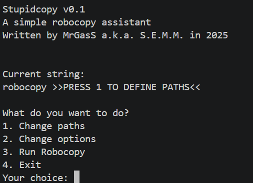

# stupidcopy [WIP]
A stupid Robocopy assistant for Windows CMD written in Python  

This tool, designed for Windows Command Prompt, aims to make Robocopy as simple as possible, even for the novice user. 
It won't include a lot of fancier options, but only the ones for making a safe mirror of a directory. 
[Work in Progress...]  
<picture>
   
</picture>
